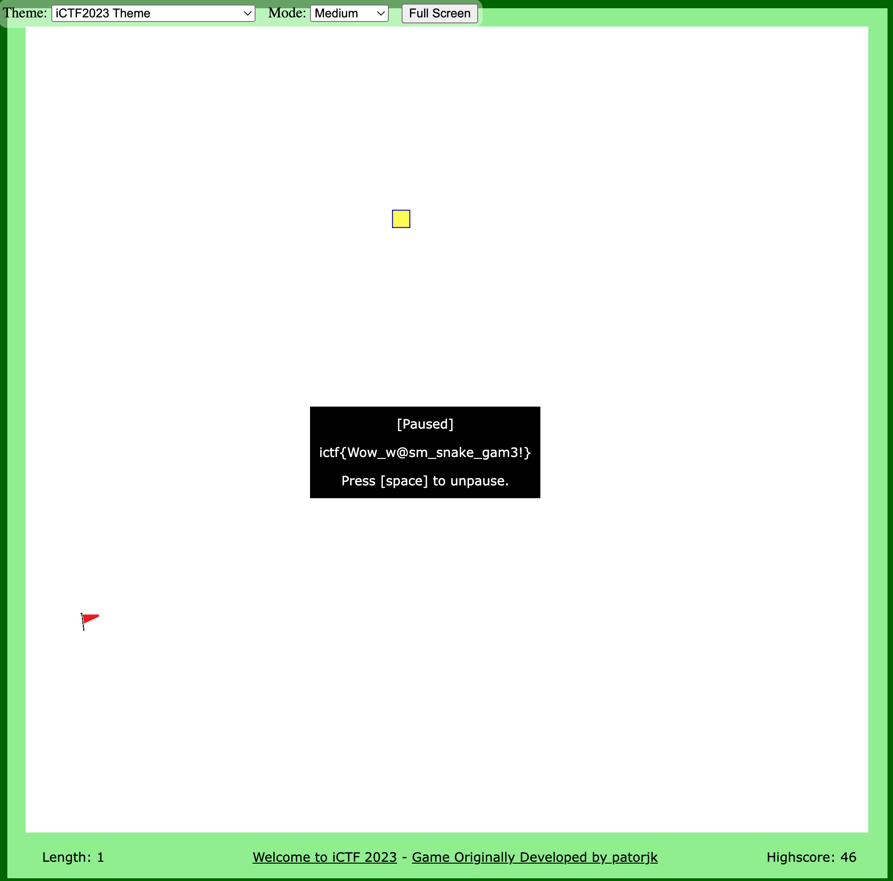

This snake game has an easter egg, which can be triggered by pressing certain arrow keys and pausing the game.

Once the player presses the correct key sequence, the flag of the challenge will show up.

Specifically, in `snake.js`, we can see:

```JavaScript
const wasmModule = typeof Module === 'function' ? Module() : Module;
const checkFunction = wasmModule.cwrap('check', 'string', ['string']);
const result = checkFunction(moves);
```

These lines pass the current moves to the `check` function from wasm, which is compiled webassembly binary code. There are many ways to reverse engineer the wasm binary code (`check.wasm`). One way is to use the [wasm2c](https://github.com/WebAssembly/wabt/blob/main/wasm2c/README.md) tool from [wabt](https://github.com/WebAssembly/wabt/tree/main):

```
wasm2c check.wasm -o check.c
```

By reverse engineering the decompiled C file, we can see that the input length should be 80 (the check is performed in `w2c_check_check_0`). Afterward, the input is encrypted using RC4 with a pre-defined key, and the encrypted input is compared with a pre-defined set of values. To get the expected input, we just do RC4 decryption using the same key. See `sol.c` for an example solution.

After the decryption, we get the expected input, which is `RDLURDLURDLURDLURDLURDLURDLURDLURDLURDLULDRULDRULDRULDRULDRULDRULDRULDRULDRULDRU`. Next, start the game, press the keys according to this sequence, and then press [space] to pause the game. The flag will show up on the screen:



We have provided the original source code [check.c](./check.c) for the `check` function as a reference.
